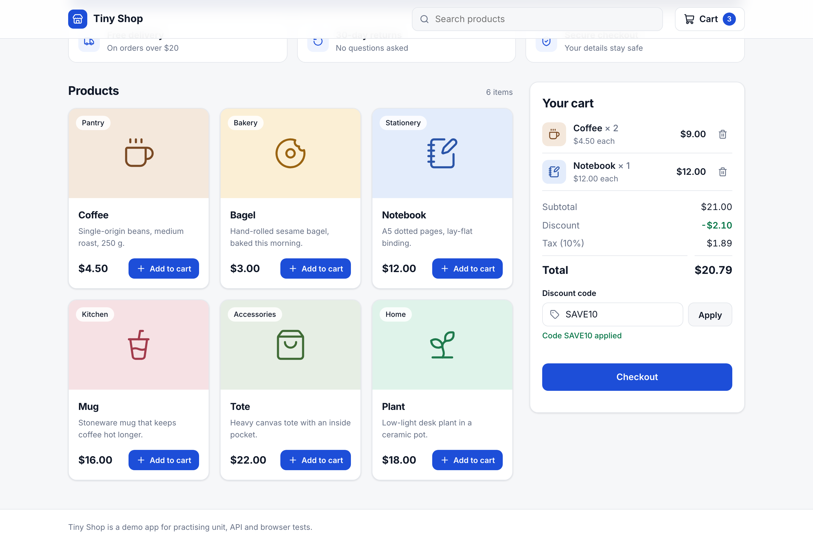

# Tiny Shop: a testing demo

A small shopping cart built with React and Express. It exists to show the different kinds of tests in one full-stack app.



## Run it

```bash
nvm use            # Node 22
npm install
npx playwright install chromium
npm run dev        # React on http://localhost:5173, API on http://localhost:3000
```

## The tests

| Layer | What it checks | Tool | Command |
|---|---|---|---|
| Server unit tests | Pricing rules: subtotal, discount codes, tax | Vitest | `npm run test:server` |
| Server API tests | The real Express app and pricing working together | Vitest + Supertest | `npm run test:server` |
| React unit tests | Components and the whole app, with the network faked | Vitest + Testing Library + MSW | `npm run test:client` |
| API automation | The running server over real HTTP | Playwright | `npm run test:e2e:api` |
| UI automation | Real user flows in a real browser | Playwright | `npm run test:e2e:ui` |

Run everything with `npm test`. Playwright builds the React app and starts the server for you.

## Where things live

```
server/src        Express app, pricing rules, in-memory store
server/tests      unit/ and api/ tests
client/src        React app
client/tests      component tests and MSW mocks
e2e/api           Playwright API tests
e2e/ui            Playwright browser tests
```

## Things worth showing in a talk

- **See a test fail.** Change `TAX_RATE` in `server/src/pricing.js` from `0.1` to `0.2` and run `npm test`. Server tests and browser tests go red. The React tests stay green, because MSW fakes the server. That is why you need tests at more than one layer.
- **Two users at once.** `e2e/ui/checkout.spec.js` opens two browsers as two shoppers and checks their carts stay separate.
- **No shared state.** Every API and browser test gets its own cart, so tests can run in parallel in any order.
- **Evidence on failure.** Playwright keeps a trace, a screenshot and a video for failed tests. Open them with `npx playwright show-report`.
